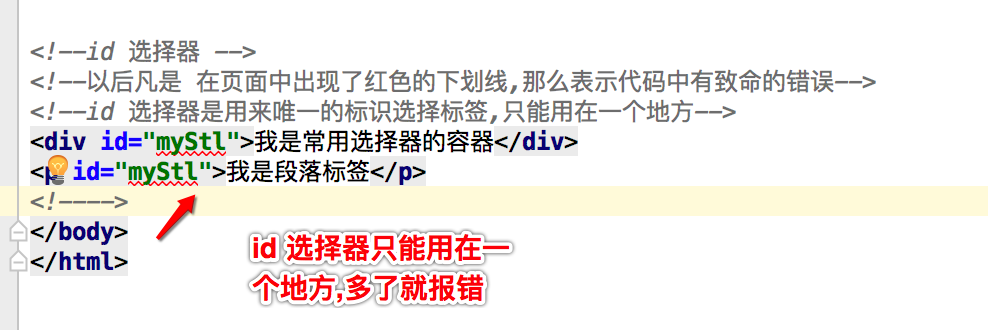

####属性
- **通过属性的复杂叠加才能做出漂亮的网页**

####选择器
- **通过选择器找到对应的标签设置样式**

####类选择器
- 1>类选择器就是 .+类名
```objc
    .test{
        color:red;
    }
```
- 2>id选择器,id选择器只能作用于一个标签,多了就会报致命错误.
```objc
<!DOCTYPE html>
<html lang="en">
<head>
    <meta charset="UTF-8">
    <title>CSS 中的常用选择器</title>

    <style>

        /*业内选择器*/
        p{
            color: red;
        }

        div{
            color: purple;
        }

        /*类选择器  . + 类名 */
        .test{
            color: yellow;
        }

        /*id 选择器 # + id */
        #myStl{
            color: blue;
        }

    </style>
</head>
    <body>

        <!--body 内只放结构和内容 涉及样式的都尽量不填写-->
        <div>我是常用选择器的容器</div>
        <div>我是常用选择器的容器</div>
        <div>我是常用选择器的容器</div>

        <p>我是段落标签</p>
        <p>我是段落标签</p>

        <!--类选择器-->
        <div class="test">我是常用选择器的容器</div>
        <p class="test">我是段落标签</p>


        <!--id 选择器 -->
        <!--以后凡是 在页面中出现了红色的下划线,那么表示代码中有致命的错误-->
        <!--id 选择器是用来唯一的标识选择标签,只能用在一个地方-->
        <div id="myStl">我是常用选择器的容器</div>
        <p id="myStl">我是段落标签</p>

    </body>
</html>
```




